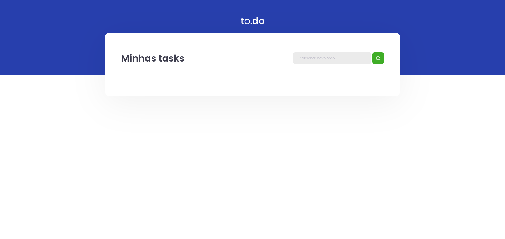

  
  
      

 

  

<h3 align="center">
  Desafio 01 - Trilha ReactJS
</h2>

	Resolução do Desafio "Conceitos do React"

## Sobre o desafio

  

Nesse desafio, você deverá criar uma aplicação para treinar o que aprendeu até agora no ReactJS

Essa será uma aplicação onde o seu principal objetivo é uma pequena aplicação de atividades a fazer, para treinar um pouco mais sobre manipulação do estado no React.

- Adicionar uma nova tarefa
- Remover uma tarefa
- Marcar e desmarcar uma tarefa como concluída

## Status do desafio

✅ Completo